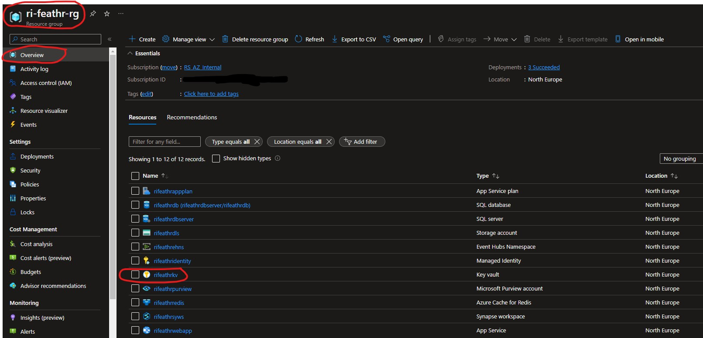
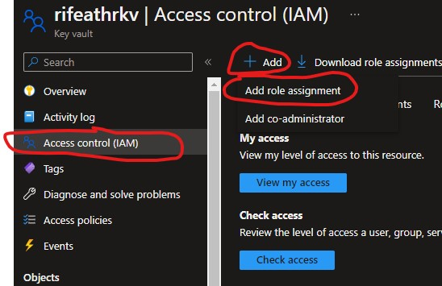
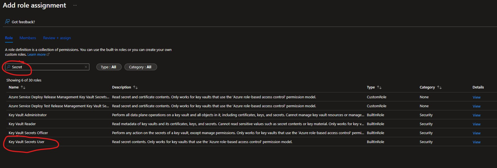
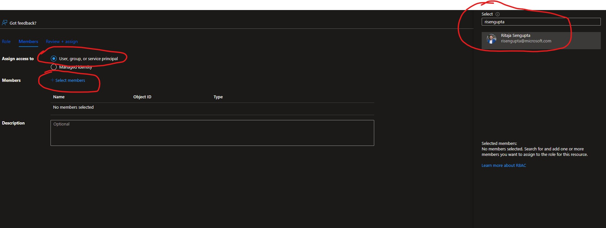

## Pre-setup, before deploying resources to Azure

The very first step is to create an Azure Active Directory (AAD) application to enable authentication on the Feathr UI (which gets created as part of the deployment script). Currently it is not possible to create one through ARM template but you can easily create one by running the following CLI commands in the Cloud Shell or local shell with Azure CLI installed and logged in.

### BASH variant of the commands, See below for powershell variant:
```bash
# This is the prefix you want to name your resources with, make a note of it, you will need it during deployment.
#  Note: please keep the `resourcePrefix` short (less than 15 chars), since some of the Azure resources need the full name to be less than 24 characters. Only lowercase alphanumeric characters are allowed for resource prefix.
resource_prefix="yourprefix"

# Please don't change this name, a corresponding webapp with same name gets created in subsequent steps.
sitename="${resource_prefix}webapp"

# Use the following configuration command to enable dynamic install of az extensions without a prompt. This is required for the az account command group used in the following steps.
az config set extension.use_dynamic_install=yes_without_prompt

# This will create the Azure AD application, note that we need to create an AAD app of platform type Single Page Application(SPA). By default passing the redirect-uris with create command creates an app of type web. Setting Sign in audience to AzureADMyOrg limits the application access to just your tenant.
az ad app create --display-name $sitename --sign-in-audience AzureADMyOrg --web-home-page-url "https://$sitename.azurewebsites.net" --enable-id-token-issuance true
```
### PowerShell variant of the commands:

```powershell
# This is the prefix you want to name your resources with, make a note of it, you will need it during deployment.
#  Note: please keep the `resourcePrefix` short (less than 15 chars), since some of the Azure resources need the full name to be less than 24 characters. Only lowercase alphanumeric characters are allowed for resource prefix.
$Env:resource_prefix = "rifeathr"

# Please don't change this name, a corresponding webapp with same name gets created in subsequent steps.
$Env:sitename="${resource_prefix}webapp"

# Use the following configuration command to enable dynamic install of az extensions without a prompt. This is required for the az account command group used in the following steps.
az config set extension.use_dynamic_install=yes_without_prompt

# This will create the Azure AD application, note that we need to create an AAD app of platform type Single Page Application(SPA). By default passing the redirect-uris with create command creates an app of type web. Setting Sign in audience to AzureADMyOrg limits the application access to just your tenant.
az ad app create --display-name ${Env:sitename} --sign-in-audience AzureADMyOrg --web-home-page-url "https://${Env:sitename}.azurewebsites.net" --enable-id-token-issuance true

```

After the above step, an AAD application will be created. Note that it will take a few minutes to complete, so make sure the `aad_clientId`, `aad_objectId`, and `aad_tenantId` below are not empty. If they are empty, re-run the three commands to refresh the values for aad_clientId, aad_objectId, and aad_tenantId, as they will be required later.

### Bash variant of the commands, See below for powershell variant:

```bash
# Fetch the ClientId, TenantId and ObjectId for the created app
aad_clientId=$(az ad app list --display-name $sitename --query [].appId -o tsv)

# We just use the homeTenantId since a user could have access to multiple tenants
aad_tenantId=$(az account show --query "[homeTenantId]" -o tsv)

#Fetch the objectId of AAD app to patch it and add redirect URI in next step.
aad_objectId=$(az ad app list --display-name $sitename --query [].id -o tsv)

# Make sure the above command ran successfully and the values are not empty. If they are empty, re-run the above commands as the app creation could take some time.
# MAKE NOTE OF THE CLIENT_ID & TENANT_ID FOR STEP #2
echo "AZURE_AAD_OBJECT_ID: $aad_objectId"
echo "AAD_CLIENT_ID: $aad_clientId"
echo "AZURE_TENANT_ID: $aad_tenantId"

# Updating the SPA app created above, currently there is no CLI support to add redirectUris to a SPA, so we have to patch manually via az rest
az rest --method PATCH --uri "https://graph.microsoft.com/v1.0/applications/$aad_objectId" --headers "Content-Type=application/json" --body "{spa:{redirectUris:['https://$sitename.azurewebsites.net']}}"
```

### PowerShell variant of the commands:

```powershell
# Fetch the ClientId, TenantId and ObjectId for the created app
$Env:aad_clientId=$(az ad app list --display-name ${Env:sitename} --query [].appId -o tsv) 

# We just use the homeTenantId since a user could have access to multiple tenants
$Env:aad_tenantId=$(az account show --query "[homeTenantId]" -o tsv)

#Fetch the objectId of AAD app to patch it and add redirect URI in next step.
$Env:aad_objectId=$(az ad app list --display-name ${Env:sitename}--query [].id -o tsv)

# Make sure the above command ran successfully and the values are not empty. If they are empty, re-run the above commands as the app creation could take some time.
# MAKE NOTE OF THE CLIENT_ID & TENANT_ID FOR STEP #2
echo "AZURE_AAD_OBJECT_ID: $Env:aad_objectId"
echo "AAD_CLIENT_ID: $Env:aad_clientId"
echo "AZURE_TENANT_ID: $Env:aad_tenantId"

# Updating the SPA app created above, currently there is no CLI support to add redirectUris to a SPA, so we have to patch manually via az rest
az rest --method PATCH --uri "https://graph.microsoft.com/v1.0/applications/${Env:aad_objectId}" --headers "Content-Type=application/json" --body "{spa:{redirectUris:['https://${Env:sitename}.azurewebsites.net']}}"

```

## Deploy Feature store resources to Azure
(The deployment template used is from the main branch of the Feathr [repository here](https://github.com/feathr-ai/feathr/blob/main/docs/how-to-guides/azure_resource_provision.json))

Locate the deploy.html file in this folder and then open it in a browser, click on the deploy to Azure button on the page. This will open the Azure Resource Manager template deployment page. Fill in the required fields: 

`Resource Group` - Create a new resource group or use an existing one.
`Region` - Select the region where you want to deploy the resources.
`Resource prefix` - Enter the same resource prefix you used in the previous step(s).
`Provision Purview` - Slect "true"
`Provision Event Hub` - Slect "true"
`Sql Admin username` - Enter the username for the SQL server.
`SQL Admin password` - Enter the password for the SQL server.
`Registry Backend` - Select Purview as the registry backend.
`Enable RBAC` - Select "true"
`Azure AD Client ID` - Enter the AAD Client ID you noted in the previous step(s).
`Azure AD Tenant ID` - Enter the AAD Tenant ID you noted in the previous step(s).

HInt: if you have deployed resources previously, you need to purge the keyvault so that there are no conflicts on resource creation step
use: `az keyvault purge --name ${resource_prefix}kv`

Note: [Adapted from this guide here, please check for updates when there are breaking changes](https://feathr-ai.github.io/feathr/how-to-guides/azure-deployment-arm.html#1-create-an-azure-active-directory-aad-application-to-enable-authentication-on-the-feathr-ui)


## Add your Azure AD user ID to keyvault in feather resource group, so that you can access the secrets in keyvault

Navigate to the feathr resource group and open the keyvault. Add your user ID to the access policies. This will allow you to access the secrets in the keyvault.

- Navigate to Feathr resource group from Azure Portal, find the keyvault:


- Open the keyvault and click on "Access control (IAM)", then click on "Add" and then "Add role assignment":


- Under the "Role" tab select "Key Vault Secrets User":


- Navigate to "Members" tab, click on "+Select members" and then "Add" to add your user ID, click on your user ID and then click on "Select" below, finally click on "Review + Assign" and wait for the changes to finish:



## Create the necessary environment

- Make sure you have conda/miniconda installed on your machine

- Create a new conda environment and activate it

```bash
conda create -f environment.yml
conda activate datascience-env
```

## Upload data

- navigate to the `data` folder and locate the `nyc_taxi.parquet` file

- Navigate to Azure Portal and open the storage account you created in the previous step(s)

- Click on "Container" and then click on "+ Container", name the container `nyctaxi` and upload the data `nyc_taxi.parquet` file to this new container

## Run the notebook
- A notebook is provided in this folder to help you get started with the feature store. Open the notebook and follow the instructions in the notebook to get started. THe notebook is named `nyc_taxi_demo.ipynb`

- The Feathr config file is provided in this folder as well, it is named `feathr_config.yml`. You will not need to change the values in this file, most of the required parameters for this exercise will be set from the notebook as environment variables.
